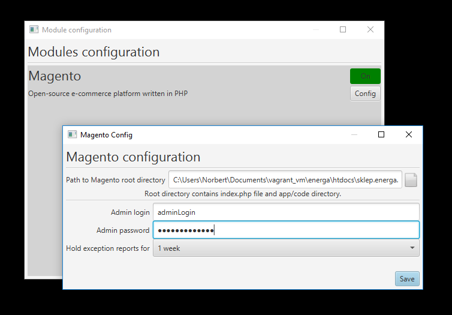
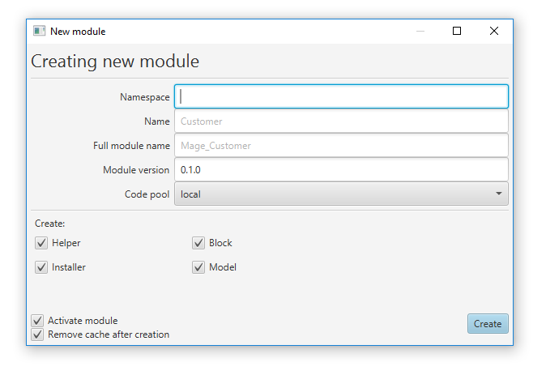

# VMSM


Virtual Machine Server Manager

**index**
1. [Installation](#installation)
    * [.JAR file](#jar-file)
    * [Download and compile](#download-and-compile)
    * [(Windows) pin VMSM to task bar / start screen](#windows-pin-vmsm-to-task-bar--start-screen)
1. [Managing VMs](#managing-vms)
    * [Create new VM](#create-new-vm)
    * [Checking and changing VM state](#checking-and-changing-vm-state)
    * [Switching between VMs](#switching-between-vms)
    * [Editing and deleting VMs](#editing-and-deleting-vms)
    * [Managing modules](#managing-modules)
1. [Magento](#magento)
    * [Magento Module configuration](#magento-module-configuration)
    * [Clearing var files](#clearing-var-files)
    * [Login to administrator panel](#login-to-administrator-panel)
    * [Creation of modules](#creation-of-modules)

## Installation
**System requirements:**
* Newest version of Java Runtime Environment

You can either download ready-to-use .JAR file or download source code and compile it.

### .JAR file

Download [latest release of VMSM.jar](https://github.com/ShookTea/VMSM/releases/latest) and run it either by
double click (if your OS support it) or by command:

```
java -jar VMSM.jar
```

### Download and compile

1. Download source code (`git clone https://github.com/ShookTea/VMSM.git`),
1. Import to IntelliJ IDEA,
1. Solve all dependencies from Maven,
    * `org.json:json:20180130`
    * `org.reactfx:reactfx:2.0-M5`
1. Compile and run.

### (Windows) pin VMSM to task bar / start screen

*Note: tested on Windows 10 only*
1. [Download VMSM.jar](https://github.com/ShookTea/VMSM/releases/latest),
1. Create new shortcut to `.jar` file. It can be located anywhere for now,
1. Rename shortcut to "VMSM",
1. Right-click shortcut and select `Properties`,
1. Edit `target` field by adding `explorer ` (with space) before existing target, i.e. `explorer C:\Users\Norbert\IdeaProjects\VMSM\out\artifacts\VMSM_jar\VMSM.jar`,
1. (*not required*) Change shortcut icon if you want,
1. Close Properties dialog,
1. Right-click shortcut and select `Pin to task bar` and/or `Pin to start screen`,
1. Delete shortcut.

## Managing VMs

### Create new VM
* Open `New VM` dialog via 
    * `Virtual machines/New VM` menu, or
    * `Virtual machines/VM Manager` menu and pressing `New VM` button
* Choose name for your virtual machine. It's highly recommended to use unique names.
* Currently there is only one type of virtual machines: Vagrant.
* Select path to your VM's root directory. Its a directory that contains `.vagrant/machines` directory. If you choose
    wrong path, you'll get an information about that.
* (*not required*) write URL address to HTTP server hosted on your VM. It can be either IP address or domain address (for
    example if you configured your `hosts` file)
* Press `Create` button.

New VM will be selected automatically.

### Checking and changing VM state
There is an Vagrant icon (blue V) right over address field. Ball located next to Vagrant icon can be in one of three
colors, indicating VM state:
* red - VM is not running
* green - VM is on
* yellow - either VM's state is unknown yet or it's changing now.

Right after choosing your VM status icon will be yellow, which means VMSM checks state of VM. It can take up to few seconds.
When status icon is red or green, you can toggle on/off VM by simply pressing status icon (it will be yellow during process
of turning virtual machine on/off) or by using `Vagrant` menu with three options: `Start`, `Restart` and `Stop`.

If your VM is on (green icon) and you've setted up URL address during VM creation, you can press Home button next to
address field to open main page choosen by you.

### Switching between VMs
You can change your current virtual machine by selecting it in `Virtual machines` menu.

### Editing and deleting VMs
In VM Manager screen (`Virtual machines/VM Manager`) you can see more detailed list of virtual machines.
* To edit existing VM, double click entry in table. You cannot edit name and type of your VM.
* To remove existing VM, right-click entry in table and confirm your decision.

Editing and removing VMs are permanent actions.

### Managing modules
After choosing virtual machine, open it's menu and select `Managing modules`. Here you can turn on and off modules
available for your VM and configure them.

## Magento

Magento is an open-source e-commerce platform written in PHP. Magento module can work with Vagrant VM.

After successful installation and configuration of module, new menu and toolbar icons are displayed.

### Magento Module configuration



* **Path to Magento root directory** is required to use most of the features of Magento module. Root directory contains
`index.php` file, `app/code` and `var` directories.
* **Admin login** and **Admin password** to Magento admin panel are not required, but writing them allows VMSM to autologin
when you need.

*Important note*: For now, modules configuration (including password to admin panel) is stored in plain text file. If
your password needs to be safe (for example because you're using it in other places as well), do not write it in module 
configuration.

### Clearing var files

One of the most often removed files in Magento are cache files. You can delete them either by pressing trash button
on toolbar (next to Magento icon), using `Ctrl+D` shortcut or in `Magento/Delete cache files` menu. You can also delete 
cache, logs, sessions and exception reports in `Magento/Delete` menu. `Delete all` removes all of these files.

### Login to administrator panel

After pressing green person icon in toolbar, selecting `Magento/Login to admin panel` menu or using `Ctrl+A` shortcut
you will be redirected to Magento admin panel. Address to that panel is taken from `MAGENTO_ROOT/app/etc/local.xml` file,
from `config/admin/routers/adminhtml/args/frontName` node, and appended to VM main URL. For example, if your main URL
is `https://magento.local` and front name in `local.xml` file is declared as `adm`, then after pressing Login button you will
be redirected to `https://magento.local/adm` webpage. If front name is not declared, it's default value is `admin`.

If you have stored your login and/or password in [configuration](#magento-module-configuration), pressing Login button
will also automatically fill input fields in login form. If you've stored both login and password, form will be also
submitted, which means that after correct configuration of module pressing that button will log you in to administrator
panel automatically.

### Creation of modules

After choosing `Magento/Create new module...` menu or using `Ctrl+Shift+N` shortcut, New Module window will be displayed.



Important notes:

* Namespace, module name and full name are all connected to each other. Full name is equal to namespace and module name
connected with underline _.
* Root directory of new module is `MAGENTO_ROOT/app/code/CODE_POOL/NAMESPACE/MODULE_NAME`.
* Module declaration will be stored in `MAGENTO_ROOT/app/etc/modules/FULL_NAME.xml`.
* Blocks and models will create empty directories `Block` and `Model` in module root directory.
* Installers will create `install-VERSION.php` file in `sql/FULL_NAME_setup/` directory, with code:

```php
<?php
$installer = $this;
$installer->startSetup();

$installer->endSetup();
```

* Helpers will create `Data.php` file in `Helper` directory, with code:

```php
<?php
class Namespace_ModuleName_Helper_Data extends Mage_Core_Helper_Abstract
{

}
```

* Configuration file in `etc/config.xml` will contain all basic information about modules, including configuration of models, blocks, helpers and installers.
* If `Activate module` is selected, module will be marked as active by default. Turning it on in Magento configuration won't be necessary.
* If `Remove cache after creation` is selected, cache files will be removed after creating new module.