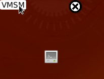
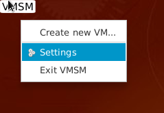

[← back to index](../index.md)

## Installation

To properly run VMSM you need Java Runtime Environment. Java 8 and newer versions are supported.

1. Download [latest release of VMSM.jar](https://github.com/ShookTea/VMSM/releases/latest)
1. Run `VMSM.jar` either by double clicking on icon (if your OS supports it) or by using command:

```bash
java -jar VMSM.jar
```

### Pin VMSM to task bar / start screen

*Note: tested on Windows 10 only*
1. [Download VMSM.jar](https://github.com/ShookTea/VMSM/releases/latest),
1. Create new shortcut to `.jar` file. It can be located anywhere for now,
1. Rename shortcut to "VMSM",
1. Right-click shortcut and select `Properties`,
1. Edit `target` field by adding `explorer ` (with space) before existing target, i.e. `explorer C:\Users\User\Documents\VMSM.jar`,
1. (*not required*) Change shortcut icon if you want,
1. Close Properties dialog,
1. Right-click shortcut and select `Pin to task bar` and/or `Pin to start screen`,
1. Delete shortcut.

## Introduction to VMSM
When you start VMSM for the first time, you will see small button with "VMSM" label on upper left corner of your screen.


After pressing it with your primary mouse button, you will see a quick menu buttons around main button.



After pressing main button with your secondary mouse button, you will see a main menu of VMSM.



Content of both of these menus change when working with VMSM, i.e. adding new virtual machine or modules.

To close VMSM, click X button on Quick Menu or choose "Exit VMSM" from main menu.