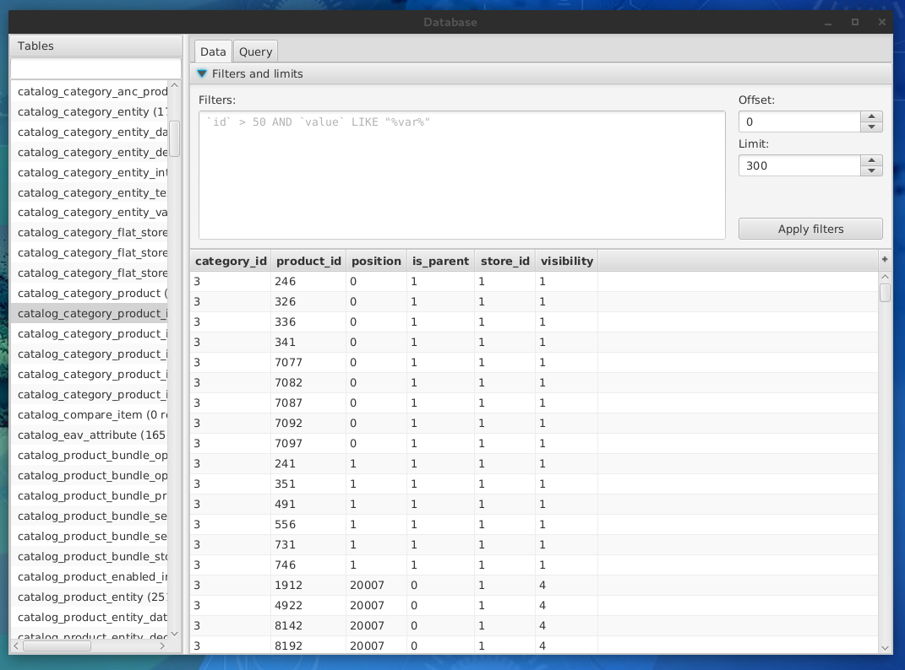

[← back to index](../index.md)

## MySQL

**MySQL** module allows you to access MySQL database.

Module configuration will ask you about:
* *host address*, which can be either domain or IP address, with selected port. By default it's uses localhost address
    (`127.0.0.1`) to be used with SSH tunelling, but that's not required.
* *Login data*: database name, username and password.

You can also enable SSH tunnelling. That will require additional configuration. If you have [configured SSH module](ssh.md),
configuration of tunnelling will be done automatically.

After properly configuring MySQL module, you can open terminal in main menu (`MySQL/Open terminal...`). You can also
use newer GUI via main menu or quick menu.

