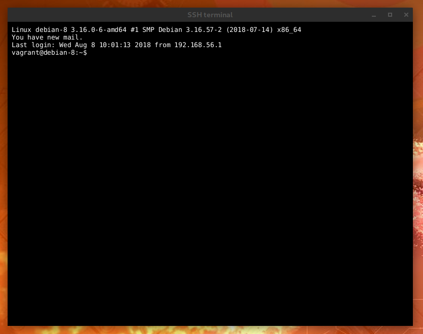

[← back to index](../index.md)

## SSH

**SSH** (Secure Shell) is a technology for safe communication with other machines. SSH module for VMSM allows
you to open terminal and connect directly with your VM.

SSH configuration will ask you about:
* *host address*, which can be either IP or domain address. Address of VM will be used as default value here.
* *username* and *password* - credentials used to log in to remote computer.

After properly configuring SSH module, you can open terminal in main menu (`SSH/Open terminal...`) or via quick menu
button with computer icon.

