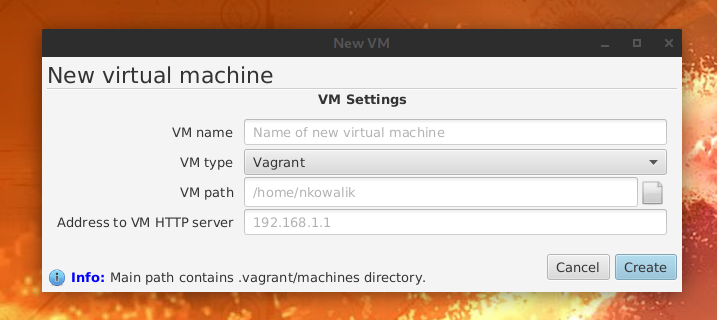

[← back to index](../index.md)

## Adding new virtual machine

If you haven't yet added any new virtual machine to VMSM, you can open New VM window from button in Quick Menu or
via "Create New VM..." menu item from main menu. If you already have a virtual machine, "Create new VM..." item
is inside 'VMs' submenu.

Fill all fields in VM creation form and press "Create". Now you have added a virtual machine and you can see its name in
the main button. After few seconds you should also get notification about whether your machine is on or off. That
notification is also displayed in main button.

## Modules

In main menu, in "your VM name / Module configuration..." you can enable, disable and configure modules available for
your virtual machines. Whether module is available or not depends on type of your virtual machine, but most of the
modules are working independently from type of VM.

## Switching VMs

You can easily add more than one virtual machine. Every one of then can use different modules. To switch between VMs,
simply select one of them in "VMs" menu.

## Managing VMs

If you want to edit or remove existing VMs, use VM Manager from "VMs" menu. You can edit VMs by double clicking on them
and remove VMs by clicking them with your secondary mouse button.